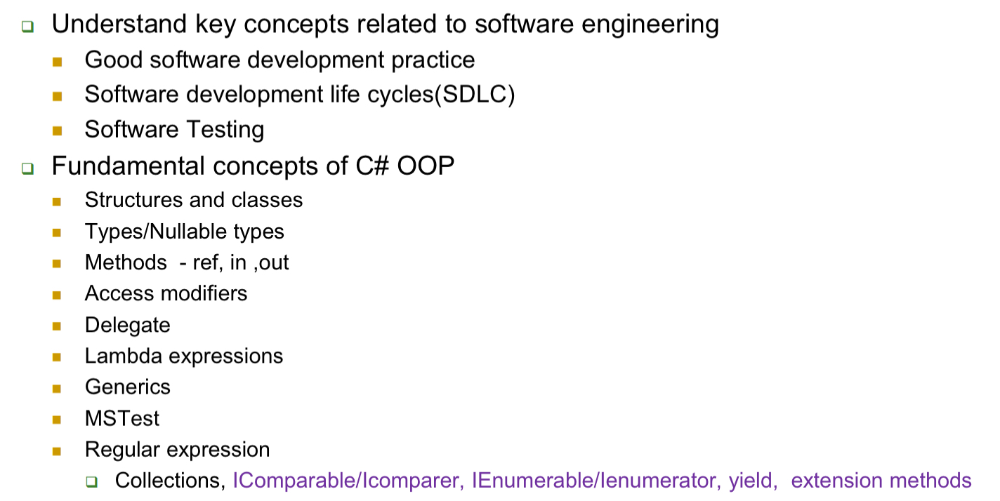
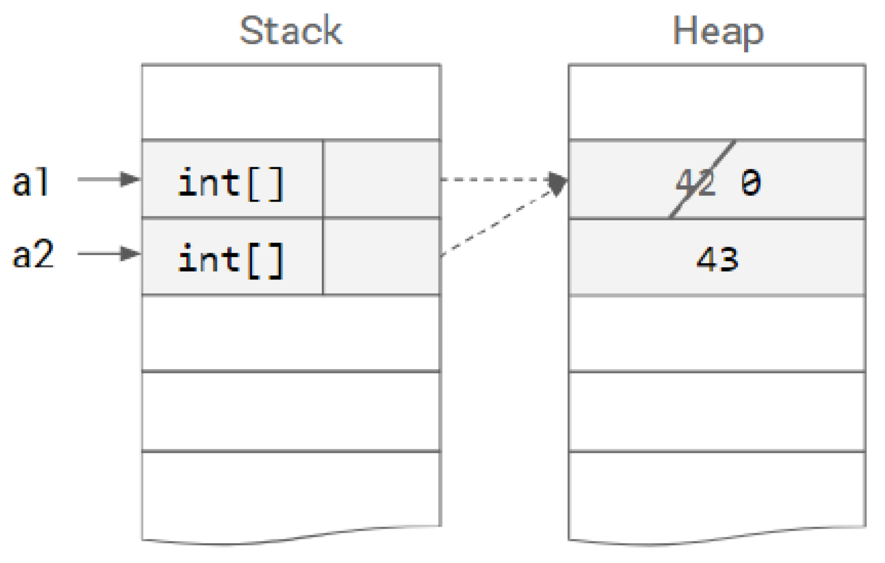
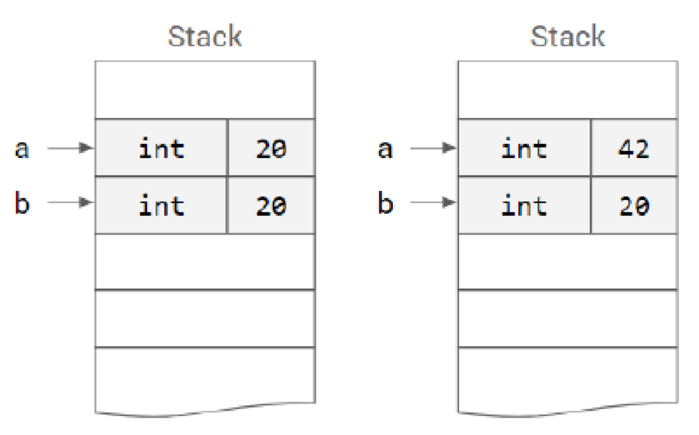
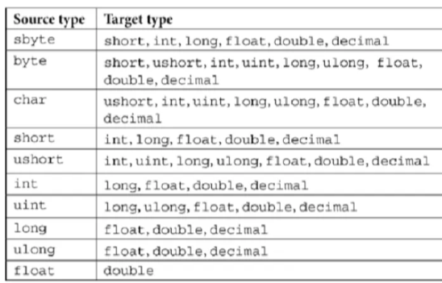
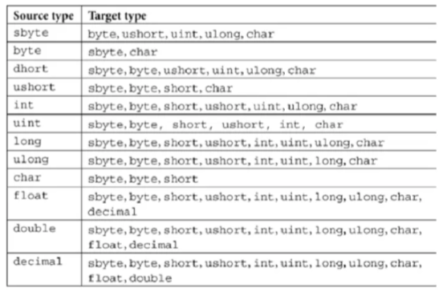
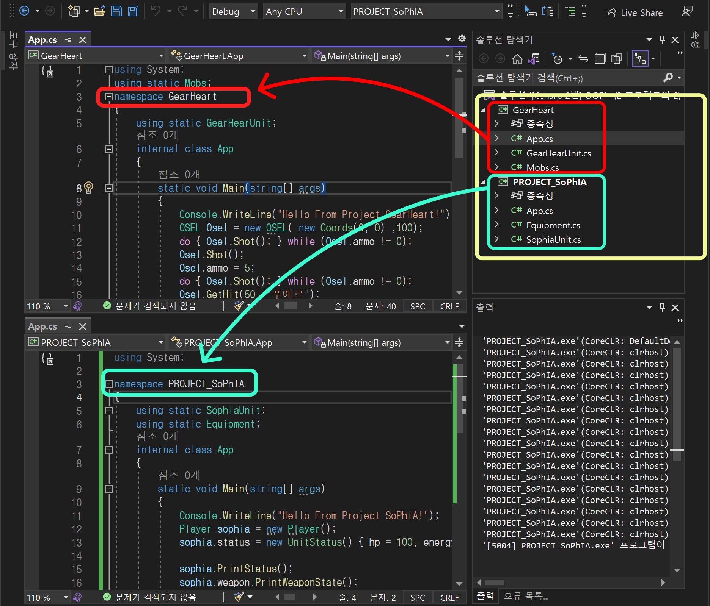
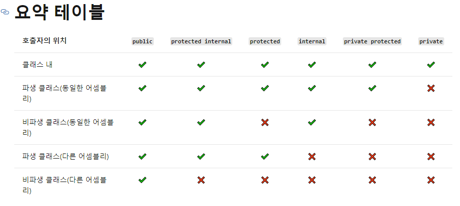

# Midterm Note

- Study Guide
    
    
    

<aside>
💡 Software Engineering Concepts

</aside>

- **SDLC**
- **Software Testing**
    
    Executing program to find errors
    
    - identify difference between expected & actual results

<aside>
💡 C# Fundamentals to Advanced Topics (Extension, Events)

</aside>

## 1. C#, Data types, Variables, Strings

---

 *  console always take input as string

 *  no automatic garbage collector

`namespace` — create space preventing name conflict

top-level statement — removing `Main()` & its associated class

---

**Interoperability — enables c# perform anything c++ can do**

- Managed code — code that runs under CLR (common language runtime)
- Unmanaged code — code runs outside of CLR → should use pointers (.NET enables)
- `Type-safe language ⇒ Compile error when type ain’t same
    
    ```csharp
    int a = 2.5; // Compile error
    float d = 2.5; // Compile error
    ```
    

---

**Primitive Data Types**

| integer types | sbyte, byte, short, ushort, int, uint, long, ulong | 0u, 0L, 0u (uint, long, ulong) |
| --- | --- | --- |
| Real floating-point types | float, double | 0.0f, 0.0d |
| Real type decimal precision | decimal | 0.0m |
| Boolean type | bool | false |
| String/Object | string/object | null |
| Character | char | ‘\u0000’ |
- better not to compare `double` values with `==` , use `decimal` for accuracy

```csharp
double a = 0.2;
double b = 0.1;
if(a+b==0.3) // Not equals
```

```csharp
decimal a = 0.2;
decimal b = 0.1;
if(a+b==0.3) // Equals
```

<aside>
📌 Why are we putting letters behind numbers sometimes but sometimes not? (eg. 0.2m)

</aside>

---

**Variables**

- `const`: for immutable final values
- `var`: auto type local variables
- no underscore (_) to prefix non-private fields

- unassigned variables cannot be used

```csharp
int age; // Unassigned
Console.WriteLine(age); // Compile error
```

| **Camel case** | local variables, private fields | costDetails |
| --- | --- | --- |
| **Pascal case** | types declaration, non-private fields, methods | WriteLine() |

---

**Object data type** — stores any type of object

```csharp
object height = 1.88; // double
object name = "Amir"; // string
```

<aside>
📌 How’s it different with `var` type

</aside>

**Arrays** 

```csharp
int[] arr = null;
int[] arr2 = new int[6];
var values = new[] {10, 20, 30, 40};
Console.Write(values[1]); // => 20
values.Length;
var subset = values[0..2]; // means [0,2) => 10 20
```

---

**Strings**  <System.String>

- immutable (read-only): when attempts to modify, X updates, rather stores in new location

```csharp
string str = "Hello";
str = str + " World";
```

| ~~str~~ | ~~Hello~~ |
| --- | --- |
| str | Hello World |

←value before **deleted automatically** later

⇒ inefficient, slow performance

<aside>
📌 string str = new string("Hello"); --> Error? Allowed just in java? Just use strbuilder?

</aside>

**StringBuilder** — under namespace <System.Text>

- mutable (dynamic) collection of characters ⇒ faster & efficient memory use

  →  can modify data in same memory location

```csharp
StringBuilder sb = new StringBuilder("Hello");
sb.Append(" World");
```

| sb | Hello |
| --- | --- |
|  |  |

| sb | Hello World |
| --- | --- |
|  |  |

## 2. verbatim, Nullable?, Reference/Value types, Memory

---

**String interpolation ($)**

- shortcut for `string.Format()` — **1.** $ to prefix string  →   **2.** arguments in { }
    
    ```csharp
    int i = 42;
    string s = string.Format("My mom is {0} years old.", i);
    string s2 = $"My mom is {i} years old.";
    
    Console.WriteLine("{0} * {1} / {2} = {3}", a, b, c, a * b / c);
    ```
    

**Verbatim (@)**

- allows to avoid using escape sequences

```csharp
var ugly = "c:\\documents\\abc.txt";
var verbatim = @"c:\documents\abc.txt";
```

- allows keyword as variable name
    
    `string **@ref** = "hello";` 
    

---

**Nullable types**  <System.Nullable<T>>

- object.`HasValue` — checks if nullable type object is not a `null`
- object.`Value` — access the underlying value

```csharp
Nullable<int> b = null;
int? c = null; // Same as above
```

```csharp
string s = null; // Warning
string? s2 = null; // Safer
```

```csharp
int? n1 = null;
int n2 = n1 ?? 2; // => 2
int n1 = 5;
int n3 = n1 ?? 2; // => 5
```

`n2 = n1 ?? 2`

→ If `n1` is null, return 2. Else, assign `n1`

---

**Heap** — data remains unless manually deleted

**Stack** — data on stack for function deleted automatically

<aside>
📌 C# has automatic garbage collector for heap too?

</aside>

`int[] myArray;`

| Stack | Heap |
| --- | --- |
| myArray |  |

`int[] myArray = new int[6];`

| Stack | Heap |
| --- | --- |
| myArray | {0, 0, 0, 0, 0, 0} |

<aside>
📌 Why heap (reference type) is storing values while stack (value) stores variables? A: heap access value at variable’s address, while stack accesses the variable itself.

</aside>

---

**Reference Type**  <Heap>

- X contains value directly, refer to memory location
- default— empty `null` type
    
    <aside>
    
    class, array, `object`, `string`, `delegates`, `interface`
    
    </aside>
    

**Value Type** <Stack>

- contain & access value directly
    
    <aside>
    
    struct, primitive types, Enumerator
    
    </aside>
    
- can’t use `null`, but can use `nullable` type ← when no value is valid (including 0)

| **Class** | **Struct** |
| --- | --- |
| reference type | value type |
| default access— internal | default access— public |
| O implicit constructors | X default constructor |
| O inheritance | X inheritance ⇒ use extensions |

```csharp
class Point { // -> Reference type
	public int x, y;
	
	public Point(int x, int y){
		this.x = x;
		this.y = y;
	}
Point a = new Point(10, 10);
Point b = a; //a&b points same location
a.x = 100;
Console.Write(b.x); // => 100
```

`int[] a1 = new int[] {42, 43};`

`int[] a2 = a1;`                         `a1[0] = 0;`



```csharp
struct Point { // -> Value type
	public int x, y;
	
	public Point(int x, int y){
		this.x = x;
		this.y = y;
	}
Point a = new Point(10, 10);
Point b = a; //b assigned same value as a (10)
a.x = 100;
Console.Write(b.x); // => 10
```

     `int a = 20`

     `int b = a;`                               `a = 42;`



<aside>
📌 Both class & struct are mutable?

</aside>

## 3. Casting, `is` `out` … `readonly` keywords

---

**Implicit type conversion** — numeric type variable assigned to other compatible type variable

| X | O |
| --- | --- |
| anything ⇒ char/byte/sbyte | int ⇒ float |
| double/decimal ⇒ any other | long ⇒ double, decimal, float |
| double & int |  |



**Explicit type conversion** — using casting to prevent risk of losing info

- enables conversion for types incompatible implicit conversion

```csharp
double d = 12.2;
int a = (int)d;
```

      * double ⇒ int: compatible,

      * int ⇒ double: incompatible



<aside>
📌 object with reference types vs. object with value types

</aside>

---

**Boxing**— implicitly converting value types → reference types

**Unboxing**— explicitly converting reference types → value types

- reference type unboxed from Heap, assign value type to Stack again

```csharp
int val = 12; // Created on Stack (int = value type)
object boxedVal = val ; // Boxed on Heap (object = ref type)
int unBoxedVal = (int) boxedVal; // Unboxed from Heap, assigned back to Stack
```

<aside>

Can we store object type integer data into int type variable without casting? Error or warning?

</aside>

---

`is` — return **bool** (true/false); to check types of 2 are compatible

- used only with reference type, boxing & unboxing conversions
- prevent using overloaded operator or methods (`==`,  `Equals`)

`as` — return **object** when type is compatible, else return **null**

- allows to overcome `invalidCastException` occurring
- used only for nullable, reference type, boxing & unboxing

```csharp
object obj = "Hello";
string value = obj as string;
// => Hello
```

```csharp
object obj = 123;
string value = obj as string;
// => null
```

---

`Checked()` — check for overflow during casting ⇒ force `System.OverflowExption`

```csharp
double d = 5e9d;
int i = Checked((int) d); // => System.OverflowExption
```

**Parsing** (`Parse()`, `TryParse()`) — converts string into other types

```csharp
string s = Console.ReadLine();
int conv = int.Parse(Console.ReadLine());
double conv2 = double.TryParse(s);
```

---

**Pass by Value**

```csharp
void MakeZero(int x) // Passing by value
{
	x = 0; // Doesn't change at memory
}
```

```csharp
int y = 9;
MakeZero(y);
Console.Write(y);
// => **9** instead of 0
```

**Pass by Reference**

`ref` — create call-by-reference instead of call-by-value

```csharp
static void Swap(ref int a, ref int b);
Swap(ref num1, ref num2);
```

→ `in` — immutable type of `ref` 

```csharp
static void Dont(in int value, int string text){
	value = 42;
	++value;
	text = null;
	//=> Error. Shouldn't modify 'in' variables
}
```

→ `out` — can pass uninitialized variable to parameter, assigns value before returning

```csharp
static void Square(int input, out int output){
	output = input * input;
}
int num = 10;
int sq; // Uninitialized
Square(num, out sq); // => 100
```

---

`readonly` — similar to `const`, but can modify once

- can be used only in constructor / field declaration

```csharp
readonly int max_stack_depth = 5;
```

## 4. Access Modifiers, Static & Non-Static, Testing

---

OOP — Abstraction, Encapsulation, Inheritance, Polymorphism

- interface allows multiple inheritance

**Implicit Inheritance —**  inherit from base type <System.Object>

⇒ enables C# class objects to use its methods: `ToString()`, `GetType()`, `GetHashCode()`, etc

|  | **string** | **value-type** | **reference type** |
| --- | --- | --- | --- |
| `==` & `Equals()` | compare data | compare data | compare address |

Compare **string** type (`==`)

```csharp
string i = "Hello", j = "Hello",
s = "hello";
Console.Write(i==j); // => true
Console.Write(i==s); // => false
```

Compare **value** type (`==`)

```csharp
int i = 10, j = 10;
Console.Write(i==j);
// => true
```

Compare **reference** type (`==`)

```csharp
object i = "Hello", j = "Hello";
Console.Write(i==j);
// => true;
```

```csharp
object i = new StringBuilder("Hello");
object j = "Hello";
Console.Write(i==j);
// => false;
```

<aside>
📌 ? false because their type is different?

</aside>

---

**Access Modifiers**

| public | accessible from any class |
| --- | --- |
| protected | accessible from class itself & its descendant classes |
| private | accessible from class itself only |
| internal **(class default)** | accessible from current assembly |
| protected internal | accessible in current assembly or in derived class |

<aside>

**Assembly** — package-like project containing files under

- .dll— library with no Main(). ⇒ X run by itself
- .exe— library with Main(). ⇒ executable in its own address
    
    
    
    eg) Two different Assembly
    
    <aside>
    📌 Same namespace means same assembly? True only when Assembly’s name == name of the namespace?
    
    </aside>
    
</aside>



---

**Property** — private field with get & set methods

- **Read-only**: property with no / private setter
- **Write-only**: property with no getter

```csharp
public string LastName{
	get{ return lastNm; }
	set{ lastNm = "Kim"; }
}
```

* auto-implemented properties — 

compiler provides private field

⇒ use constructor to set values 

---

Static class — contains only static members (methods & variables); common to all (global)

- Static methods — associated with the class ( `MyClass. MyStaticFunc()` )
- non-static methods — associated with the object ( `myObject. MyFunc()` )

**Non-static methods (instance)** — requires object to call

```csharp
string SayHello(string name) // Non-static
{
	return name;
}
static void Main(){
	Program p = new Program();
	string str = /*Program.*/SayHello("John!"); // No need to call class name.
}
```

**Static methods** — X accessible/modifiable instance variables

- should call with class name to access

```csharp
public static Emp Create(int gpa, char grade) {
	return new Emp(id++, gpa, grade);
}
```

```csharp
Emp obj1 = **Emp**.Create(4, A);
int idNum = obj1.EmpId;
char gradeLetter = obj1.Grade;
```

---

**Testing** 

- Test case — triplet of (**input / state of system / output)**
    - designed, X random: each case should detect different errors
    
    *   Number of tests X determine effectiveness
    
- Test suite — set of all test cases

**2 Levels of Classification**

1. Distinguish at granularity level

| **1. Unit Testing** | test small unit of code (= functions) |
| --- | --- |
| **2. Integration Testing** | code X break other’s code |
| **3. System Testing** | exercise entire application to make it fail |
| **4. Beta Testing** | feedback of outside testers on unfinished code’s copy |
| **5. Acceptance Testing** | formal verification of requirements |
1. Test methodologies for mostly unit level

| **Black box Test (Functional)** | **White box Test (Structural)** |
| --- | --- |
| Inspects **specified** behavior — **input** & **output** | Inspects **programmed** behavior — internal logic |
| techs— equivalence, value’s boundary, error guessing  | techs— coverage of condition, branches, etc |
| available when source code X accessible | must access source code |
| Applicable at any level of testing | lower level testing (unit, integration) |

MS Unit Test:

```csharp
namespace CalcTest{
	[TestClass]
	public class MsUnitTest{
		[TestMethod]
		public void TestMethod1(){
			Assert.AreEqual("Habtamu", Calculate.Addition<T>("Hab", "Tamu"));
		}
	}
}
```

| **Arrange** | initialize, set input data |
| --- | --- |
| **Act** | invoke method trying to test |
| **Assert** | verify expected output of method |

```csharp
/*Arrange*/ int expect = 5, num = 20, denom = 4;
/*Act*/ int actual = Calculator.Library.Calculator.Divide(num, denom);
/*Assert*/ Assert.AreEqual(expected, actual);
```

## 5. Generics, Lambda, Delegates

---

**Generics** — working code for every type of data

- eg) `Queue<T>`, `Stack<T>`, `T Max<T>(params T[] Numbers)`

---

**Lambas** — anonymous function

`() => 5` == `DoIt() { return 5; }`

---

**Delegates** — stores function in variables / provides type for function

- type-safe object invoking methods of compatible return types
1. Define: 
    
    `[modifier] delegate [return type] [CallBackName]([parameter list]);`
    
    ```csharp
    public delegate void AddDelegate(int a, int b);
    ```
    
2. Instantiate:
    
    `[publicClass].[CallBackName] [name] = new [CallBackName]([subClass].[function]);`
    
    ```csharp
    // 1.
    public delegate void AddDelegate(int a, int b);
    
    // 2.
    class Program{
    	static void Main(){
    		Program p == new Program();
    		AddDelegate d = new AddDelegate(p.SumFunc); // Declare & Instantiate
    		d(11, 22); // == d.Invoke(11, 22);
    	}
    	
    	public void SumFunc(int a, int b){
    		int sum = a + b;
    	}
    }
    ```
    

**Single cast delegate** — call 1 method at a time

```csharp
public delegate **void** SingleDelegate(int a, int b); // Matching type w/ Add() & Sub()

class Program{
	public **void** Add(int x, int y){...} // non-static
	public static **void** Subtract(int x, int y){...} // static

	static void Main(){
		Program obj = new Program();
		**SingleDelegate d1 = new SingleDelegate(obj.Add);
		d1(200, 75);**
		SingleDelegate d2 = new SingleDelegate(Substract);
		d2(200, 75);
	}
}
```

**Multi cast delegate** — refers multiple methods at once

- Returns only **last** element ⇒ recommended to use only for `void`
- methods invoked in sequential order
- `+` , `-` — add or remove method from delegate instance

<aside>
📌 ?

</aside>

```csharp
static void Main(){
		Program obj = new Program();
		SingleDelegate d1 = new SingleDelegate(obj.Add);
****		SingleDelegate d2 = new SingleDelegate(Substract);
		****d1(200, 75); // != with d1 += d2?
		**d2(200, 75);**
}
```

**Generic delegate** — avoid defining my own delegate all the time

1. **Action Delegate** <void> function
    - accepts 1 or more input parameter
    - returns `null`
    
    ```csharp
    namespace GenericDel{
    	class Program{
    		static void Main(){
    			**Action<int, float, double> obj = new Action<int, float, double> (SumFunc);**
    			**obj(20, 25.4f, 12.45);** 
    			// => null?
    		}
    		
    		// **Void** type function -> **Action**<>
    		public static **void** SumFunc(int a, float b, double c)
    		{
    			Console.Write(a + b + c);
    		}
    	}
    }
    ```
    
2. **Func Delegate** <non-void> function
    - accepts 1 or more input parameter
    - return 1 output & same type as final parameter
    
    <aside>
    📌 If it has 1 input parameter, its input and return value type equals ?
    
    </aside>
    
    ```csharp
    namespace GenericDel{
    	class Program{
    		static void Main(){
    			**Func<int, double, double> obj = new Func<int, double, double> (SumFunc);**
    			// Output double type
    			**double** output = **obj(20, 12.45);**
    		}
    		
    		// **Double** type function -> **Func**<>
    		public static **double** SumFunc(int a, double c)
    		{
    			Console.Write(a + c);
    		}
    	}
    }
    ```
    
3. **Predicate Delegate** <bool> function
    - accepts 1 input parameter
    - return `bool` type
    
    ```csharp
    namespace GenericDel{
    	class Program{
    		static void Main(){
    			**Predicate<string> obj = new Predicate<string> (Check);**
    			**bool** output = **obj("Hello");**
    		}
    		
    		// **Double** type function -> **Func**<>
    		public static **bool** Check(string name)
    		{
    			...
    		}
    	}
    }
    ```
    

## 6. Abstract, Interface, Extensions

---

**Abstract class** — class containing Abstract memebers

- default modifier — `internal`
- Can’t be instantiated, but can reference
    
    <aside>
    📌 ?
    
    </aside>
    

**Abstract method** — only declaration, X method body or definition

- only within **Abstract class**
- must be set in `public` ⇒ enable child class overriding (default: `private`)
- Child class must override & implement Abstract methods
    
    ⇒ can use non-abstract methods of parent class
    

```csharp
// **Abstract** class
**abstract** class Parent{
	// **Abstract** method
	public **abstract** void Add(int x, int y);
}

// Child class
class Child : Parent {
	public **override** void Add(int x, int y){ // Overriden **abstract** method
		int z = x + y; // Must be implemented
	}
}
```

---

**Interface** — class containing only abstract methods

- default — `public` (no modifier) ⇒ to use in other classes w/o overriding
- X field (variables)
- O definition, implementation (not necessary)
    - `abstract` methods — X implement still
        - must be `public` in **interface**
    - `virtual` methods — MUST implement
- allows multiple inheritance of interfaces

<aside>
📌 Should child class be under same namespace(or even assembly/library) with interface or parent class?

</aside>

```csharp
namespace Demo{
	**interface** ITest1{
		~~int x;~~ // => error
		int Add();
		//Must implement
		**virtual** int Double(int x){
			x *= 2; 
		}
		//Should X implement
		public **abstract** int Sub();
	}
	
	**interface** ITest2:**ITest1{**
		int Subtract(int a, int b);
	**}**
	
	
	**class** OrdinaryClass:**ITest2**{
		**public** int Add(){
			return a + b;
		}
		**public** int Subtract(){
			return b-a;
		}
	}
}
```

- method from interface — should be set `public` in class

<aside>
📌 can abstract class be child class of an interface? Can it have other than methods?

</aside>

---

**Extensions** — additional function for class we X own; (X modifies or access source code)

⇒ enables inheritance for sealed class & structure

- defined in `static` class
- only **1 binding parameter** — @ 1st parameter place
- Name should be unique to be called

`[accessModifier] static [returnType] [Name] (this [binding parameter]) {};` 

* `this` → indexing

<aside>
📌 Should the class of binding type be in same namespace with the class containing Extension methods? That class containing Extension methods must be public always?

</aside>

```csharp
namespace Extensions{
	**static** class myExtension{

		//**Extension method**
		public **static** bool **Check**(this **Program p**)
		{
			if ()
		}
	}
}
```

→ Parameter binds to existing class

```csharp
using Extensions;

namespace Demo{
	public class Program{
		public void Main(){
			Program p = new Program();
			bool d = **p.Check()**;
		}
	}
}
```

## 7. IEnumerable, Regex, Events

---

**Event** — communication between 2 objects

- **Publisher** — class sending (raise) event
    
    -  eg) buttons raise events
    
- **Subscriber** — class receiving (handle) event
    - example & step
        
        **Publisher class:**
        
        1. Declare a `delegate`
        
        ```csharp
        public delegate **void** Notify(); //Delegate
        ```
        
        1. Declare delegate variable with `event` 
        
        ```csharp
        public delegate void **Notify**(); //Delegate
        
        public class Logic{
        	public **event Notify** ProcessComplete; //Event
        	
        	public void Start(){
        		OnComplete();
        	}
        	
        	protected virtual void OnComplete(){
        		ProcessComplete**?**.Invoke();
        	}
        }
        ```
        
        <aside>
        📌 why virtual?
        
        </aside>
        
        → If `ProcessComplete()` is X null, calls `delegate`
        
        **Subscriber class:**
        
        ```csharp
        class Program{
        	public static void Main(){
        		Logic a = new Logic();
        		a.ProcessComplete += LogicComplete; // Register with event
        		a.Start();
        	}
        	
        	public static void LogicComplete(){
        		Console.Write("Completed !");
        	}
        }
        ```
        

`EventHandler`<EventArgs> — Built-in Delegate

- 

---
